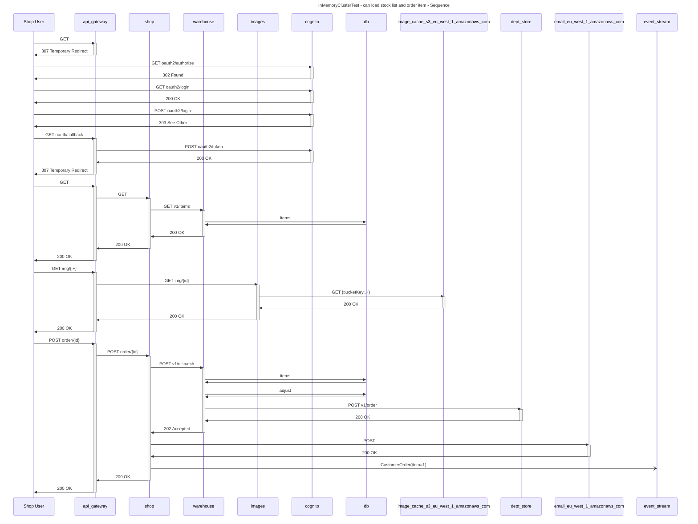
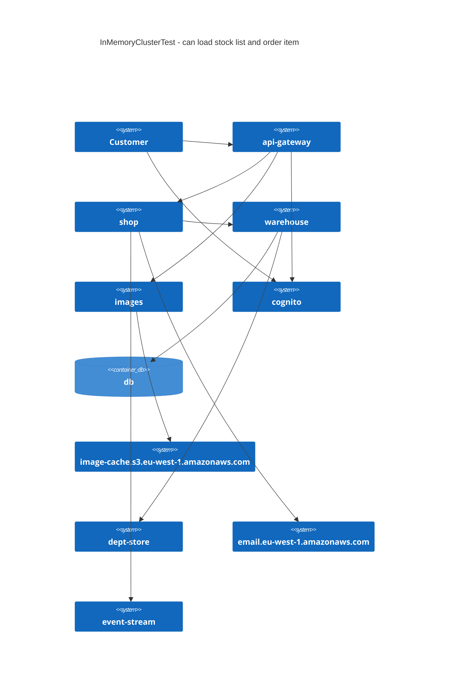

# InMemoryClusterTest - can load stock list and order item

## InMemoryClusterTest - can load stock list and order item - Maximum Trace Depth

| Origin | Target | Request |  Max Depth  |
|:------:|:------:|:-------:|:-----------:|
|	Shop User	|	api-gateway	|	GET 	|	4	|
|	Shop User	|	api-gateway	|	POST order/{id}	|	4	|
|	Shop User	|	api-gateway	|	GET img/{.+}	|	3	|
|	Shop User	|	api-gateway	|	GET oauth/callback	|	2	|
|	Shop User	|	api-gateway	|	GET 	|	1	|
|	Shop User	|	cognito	|	GET oauth2/authorize	|	1	|
|	Shop User	|	cognito	|	GET oauth2/login	|	1	|
|	Shop User	|	cognito	|	POST oauth2/login	|	1	|

## InMemoryClusterTest - can load stock list and order item - Trace Step Counts

| Origin | Target | Request |  Steps  |
|:------:|:------:|:-------:|:-------:|
|	Shop User	|	api-gateway	|	POST order/{id}	|	8	|
|	Shop User	|	api-gateway	|	GET 	|	4	|
|	Shop User	|	api-gateway	|	GET img/{.+}	|	3	|
|	Shop User	|	api-gateway	|	GET oauth/callback	|	2	|
|	Shop User	|	api-gateway	|	GET 	|	1	|
|	Shop User	|	cognito	|	GET oauth2/authorize	|	1	|
|	Shop User	|	cognito	|	GET oauth2/login	|	1	|
|	Shop User	|	cognito	|	POST oauth2/login	|	1	|
